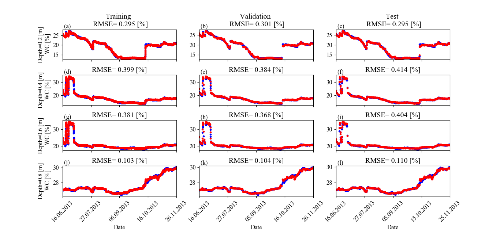

# Soil-Moisture-Estimation-
Soil moisture prediction using one-dimensional convolutional neural network.
Soil moisture is the amount of water stored in the unsaturated zone, where the soil is made of different layers (soil profile) each with different properties. Estimation of soil moisture is highly useful in irrigation scheduling, crop yield forecasting, drought alerts and runoff predictions.

# Reference Data
The reference dataset was collected in the Chicken Creek catchment in Lusatia, Germany. Further description of the catchment is provided on the paper "Machine learning to estimate soil moisture from geophysical measurements of electrical conductivity" written by Davood Moghadas and Annika Badorreck (2019). Measurements of soil moisture, temperature and soil electrical conductivity were collected at different depths (0.2, 0.4, 0.6 and 0.8 m) for a period of 5 months. A 1D CNN was constructed with the dataset considering soil electrical conductivity and temperature as input to the network. As a result, the network was able to capture the interdepencies between soil electrical conductivity and soil moisture content in different depths and showed strong correlation.

# Time series plot

# Loss plot

